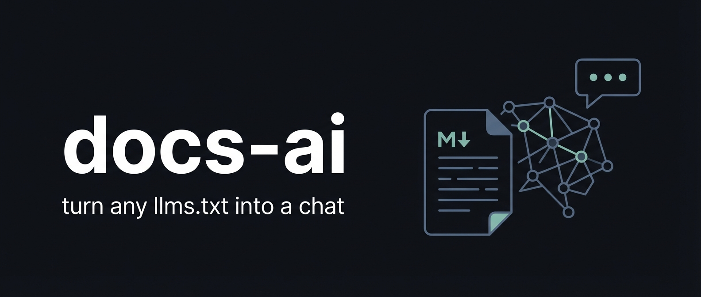

<p align="center">
  
</p>

<p align="center">
  <a href="https://www.python.org/downloads/"></a>
  <a href="https://fastapi.tiangolo.com"></a>
  <a href="https://ai.pydantic.dev"></a>
  <a href="LICENSE"></a>
  <a href="https://docs.astral.sh/uv/"></a>
</p>

<br/>

**docs-ai** is a self-hosted service that turns any [`llms.txt`](https://llmstxt.org) file into a fully functional chat interface. Point it at one or more `llms.txt` URLs and you instantly get an AI assistant that knows your documentation — nothing else.

No vector databases. No embeddings pipeline. No proprietary lock-in. Just a URL and an LLM.

> Originally built to power the [Kelet](https://kelet.ai) docs assistant — an AI that diagnoses and fixes AI agent failures.

---

## How it works

```
llms.txt URL(s)
     │
     ▼
 BFS crawler ──► fetches all linked pages concurrently
     │
     ▼
 BM25 index  ──► full-text search, zero dependencies
     │
     ▼
 FastAPI + pydantic-ai agent
     ├── GET  /chat?q=...        plain text, stateless (great for curl)
     └── POST /chat              SSE stream, multi-turn sessions (in-memory by default, Redis when REDIS_URL is set)
```

The agent has two tools: `search_docs(query)` for discovery and `get_page(slug)` for full-page retrieval. It answers strictly from your documentation — no hallucinated API names, no general-knowledge drift.

---

## Features

- **Universal** — any site with an `llms.txt` works; supports multiple sources and nested `llms.txt` files (BFS crawl)
- **Two chat modes** — stateless `GET` for scripts/CI, stateful `POST` with SSE streaming for chat UIs
- **BM25 search** — fast full-text retrieval with no embeddings, no vector DB, no GPU
- **Any LLM** — swap the model via one env var: OpenAI, Anthropic, AWS Bedrock, Ollama, or anything [pydantic-ai](https://ai.pydantic.dev) supports
- **Session memory** — multi-turn conversations with configurable TTL; in-memory by default, Redis for persistence and multi-replica deployments
- **Rate limiting** — per-IP fixed-window counter; in-memory for single-instance, atomic via Redis for multi-replica
- **Auto-refresh** — docs are re-fetched in the background on a configurable interval
- **Production-ready** — Helm chart, HPA, health checks, and proxy-aware IP resolution included

---

## Installation

Pick the method that fits your setup.

---

### Docker Compose (quickest)

**Prerequisites:** Docker, Docker Compose, and an LLM API key.

```bash
git clone https://github.com/your-org/docs-ai.git
cd docs-ai
cp .env.example .env
```

Edit `.env`:

```bash
# Point at your own docs, or use any public llms.txt
DOCS_LLMS_URLS=https://yoursite.com/llms.txt

# Set your LLM (see "Choosing a model" below)
DOCS_AI_MODEL=openai:gpt-4o
OPENAI_API_KEY=sk-...
```

Start the service (includes Redis):

```bash
docker compose up
```

> This uses `Dockerfile.dev` with live-reload and source mounts — ideal for local development. For a production image, use the Docker section below.

The service starts at `http://localhost:8001`. Verify it's ready:

```bash
curl http://localhost:8001/health
# → {"status":"ok"}

curl "http://localhost:8001/chat?q=how+do+I+get+started"
# → plain text answer from your docs
```

---

### Docker

Build the production image. Redis is optional — omit `-e REDIS_URL` to use in-memory storage (single-process, not persistent). Include it for persistent sessions and multi-replica deployments:

```bash
git clone https://github.com/your-org/docs-ai.git
cd docs-ai

# Build the image
docker build -t docs-ai .

# Start Redis
docker run -d --name docs-ai-redis redis:7-alpine

# Start the service
docker run -d \
  --name docs-ai \
  --link docs-ai-redis:redis \
  -e DOCS_LLMS_URLS=https://yoursite.com/llms.txt \
  -e DOCS_AI_MODEL=openai:gpt-4o \
  -e OPENAI_API_KEY=sk-... \
  -e REDIS_URL=redis://redis:6379 \
  -p 8001:8001 \
  docs-ai
```

Check it's up:

```bash
curl http://localhost:8001/health
# → {"status":"ok"}
```

---

### Python

Requires Python 3.13+ and [uv](https://docs.astral.sh/uv/).

```bash
git clone https://github.com/your-org/docs-ai.git
cd docs-ai
uv sync
cp .env.example .env   # edit DOCS_LLMS_URLS and DOCS_AI_MODEL
```

By default the service uses in-memory storage — no Redis required. To enable Redis (recommended for persistent sessions and multi-replica deployments), set `REDIS_URL` in your `.env`. Then:

```bash
uv run uvicorn app.main:app --host 0.0.0.0 --port 8001 --reload
```

---

## API reference

### `GET /chat?q=<query>`

Stateless, single-turn query. Returns plain text. No session, no history.

```bash
curl "http://localhost:8001/chat?q=what+is+a+session"
```

Ideal for CLI integrations, scripts, and CI bots.

---

### `POST /chat`

Stateful, multi-turn conversation over **Server-Sent Events**.

**Request body:**

```json
{
  "message": "How do I install the SDK?",
  "session_id": null,
  "current_page_slug": "docs/getting-started"
}
```

| Field | Type | Description |
|---|---|---|
| `message` | `string` | Required. Max 4000 chars. |
| `session_id` | `string \| null` | Pass the ID from a previous response to continue a conversation. `null` starts a new session. |
| `current_page_slug` | `string \| null` | The page the user is currently viewing. Gives the agent helpful context. |

**Response:** `text/event-stream`

```
data: {"chunk": "To install"}
data: {"chunk": " the SDK, run..."}
data: [DONE]
```

The session ID is returned in the `X-Session-ID` response header. Pass it back in subsequent requests to maintain conversation history.

```bash
# Start a conversation
SESSION=$(curl -s -D - -X POST http://localhost:8001/chat \
  -H "Content-Type: application/json" \
  -d '{"message":"what is a session?"}' \
  | grep -i x-session-id | awk '{print $2}' | tr -d '\r')

# Continue it
curl -X POST http://localhost:8001/chat \
  -H "Content-Type: application/json" \
  -d "{\"message\":\"show me an example\",\"session_id\":\"$SESSION\"}"
```

---

### `GET /health`

Returns `200` when the store is ready and docs are loaded. Returns `503` during startup. Use this for liveness/readiness probes.

---

## Configuration

All configuration is via environment variables (or a `.env` file).

| Variable | Default | Description |
|---|---|---|
| `DOCS_LLMS_URLS` | *(required)* | Space-separated list of `llms.txt` URLs to crawl. Supports nested `llms.txt` files. |
| `DOCS_ALLOWED_HOSTS` | *(auto)* | Space-separated list of allowed hostnames the crawler may fetch. Supports wildcards (`*.example.com`). When unset, only hosts from `DOCS_LLMS_URLS` are allowed. |
| `DOCS_AI_MODEL` | `bedrock:global.anthropic.claude-sonnet-4-6` | pydantic-ai model string. See [choosing a model](#choosing-a-model). |
| `REDIS_URL` | *(unset)* | Redis connection string. If unset, the service uses in-memory storage (not persistent, single-process only). Set to a Redis URL for persistent sessions and multi-replica deployments. Use `rediss://` for TLS. |
| `DOCS_REFRESH_INTERVAL_SECONDS` | `3600` | How often to re-fetch documentation from source URLs. |
| `RATE_LIMIT_MESSAGES_PER_WINDOW` | `20` | Max requests per IP per window. |
| `RATE_LIMIT_WINDOW_SECONDS` | `3600` | Rate limit window duration in seconds. |
| `SESSION_TTL_SECONDS` | `1800` | How long chat sessions are kept before expiry. |
| `UVICORN_FORWARDED_ALLOW_IPS` | *(unset)* | Set to `*` or your load balancer CIDR when running behind a reverse proxy, so rate limiting uses the real client IP from `X-Forwarded-For`. |
| `DOCS_ALLOWED_TOPICS` | `scanned docs` | Topic scope for the assistant. The prompt strictly refuses questions outside this scope. Set to your product or org name (e.g. `MyProduct`). |
| `DOCS_CUSTOM_INSTRUCTIONS` | *(empty)* | Multiline string appended to the system prompt. Use for brand identity, product-specific recommendations, tone guidelines, etc. |
| `DOCS_SYSTEM_PROMPT_FILE` | *(empty)* | Path to a Jinja2 template file that fully replaces the built-in system prompt. The template receives `index_content`, `current_page_slug`, `stateless`, `allowed_topics`, and `custom_instructions` as variables. Useful for mounting a custom prompt via a Kubernetes ConfigMap volume. |

---

## Choosing a model

`DOCS_AI_MODEL` accepts any [pydantic-ai model string](https://ai.pydantic.dev/models/). Set the corresponding API key as an environment variable.

| Provider | Model string | Required env var |
|---|---|---|
| OpenAI | `openai:gpt-4o` | `OPENAI_API_KEY` |
| Anthropic | `anthropic:claude-sonnet-4-5` | `ANTHROPIC_API_KEY` |
| AWS Bedrock | `bedrock:anthropic.claude-sonnet-4-6` | AWS credentials via IAM/IRSA |
| Ollama (local) | `ollama:llama3.1` | *(none)* |
| Gemini | `google-gla:gemini-2.0-flash` | `GOOGLE_API_KEY` |

---

## Integrating into a UI

The `POST /chat` endpoint is designed for browser chat UIs: it streams tokens over SSE and returns a `X-Session-ID` header you pass back on subsequent requests to maintain conversation history.

To add a chat widget to your documentation site, use the **docs-ai-integration** Claude Code skill. It knows the full API contract, UI/UX spec, and user journey — and will generate idiomatic code for your framework (React, Astro, Docusaurus, MkDocs, Vue, vanilla JS, etc.):

```bash
npx skills install kelet-ai/docs-ai
```

Then in your project:

```
/docs-ai-integration
```

The skill will ask for your docs-ai deployment URL, wire it to the right environment variable for your stack, and implement the full widget: floating chip, streaming chat panel, mobile bottom sheet, typing indicator, session management, and search integration.

---

## About llms.txt

[`llms.txt`](https://llmstxt.org) is an emerging standard — a plain markdown file at the root of a site that lists the documentation URLs an LLM should know about.

```markdown
# My Project Docs

- [Getting Started](https://example.com/docs/getting-started.md)
- [API Reference](https://example.com/docs/api.md)
- [More Docs](https://example.com/other/llms.txt)   ← nested llms.txt supported
```

docs-ai performs a BFS crawl starting from your `DOCS_LLMS_URLS`, follows any nested `llms.txt` files it finds, fetches all linked pages, splits them by headings, and indexes them with BM25. The whole thing lives in memory and refreshes automatically.

---

## Running tests

```bash
# Unit and integration tests (runs in parallel)
uv run pytest -n auto

# LLM evaluation suite (requires a running service at localhost:8001)
uv run pytest tests/evals -n auto
```

---

## Deploying to Kubernetes

A production-ready Helm chart is included at `k8s/charts/docs-ai/`.

**Prerequisites:** a running Redis instance (or Kubernetes-managed Redis) and a container image pushed to a registry.

```bash
helm install docs-ai ./k8s/charts/docs-ai \
  --set image.registry=ghcr.io/your-org \
  --set image.tag=latest \
  --set config.docsLlmsUrls="https://yoursite.com/llms.txt" \
  --set config.docsAiModel="openai:gpt-4o" \
  --set-string 'extraEnv[0].name=OPENAI_API_KEY' \
  --set-string 'extraEnv[0].value=sk-...'
```

The chart reads Redis connection details from the ConfigMap keys `REDIS_HOST` and `REDIS_PORT` (default port `6379`). Override them for your environment:

```bash
  --set config.redisHost=my-redis.default.svc.cluster.local \
  --set config.redisPort=6379
```

> The default `values.yaml` leaves `REDIS_HOST` empty — the chart was originally wired to receive it from an ACK ElastiCache FieldExport. You must supply a real Redis host for the pod to start.

The chart includes:
- Horizontal Pod Autoscaler (1–4 replicas, CPU + memory metrics)
- Ingress with TLS termination (ALB annotations included; swap `ingress.className` for nginx/traefik)
- ConfigMap-backed configuration with automatic pod rollout on config changes
- Liveness and readiness probes with appropriate startup delays
- Non-root, read-only filesystem security context

See [`k8s/charts/docs-ai/values.yaml`](k8s/charts/docs-ai/values.yaml) for all options and [`k8s/environments/`](k8s/environments/) for example environment overrides.

---

## Architecture notes

**Why BM25 instead of embeddings?**
BM25 starts instantly, needs no model downloads, uses no GPU, and works fully offline. For most documentation Q&A, keyword search is accurate enough — and when it's not, the agent uses the full page retrieval tool anyway.

**Why two chat endpoints?**
The `GET` endpoint is designed for programmatic use (curl, CI, AI skills) where simplicity matters. The `POST` endpoint with SSE is designed for chat UIs where streaming and conversation continuity matter. Keeping them separate means neither compromises for the other.

**Rate limiting across replicas**
When `REDIS_URL` is set, the rate limiter uses a Redis atomic `INCR` with a TTL-based key per IP and time window — correct across any number of replicas without coordination overhead. Without `REDIS_URL`, rate limiting uses an in-memory counter that is local to each process (single-instance only).

---

## Contributing

Issues and pull requests are welcome. For significant changes, please open an issue first to discuss what you'd like to change.

---

## License

MIT

---

Originally built to power [Kelet's](https://kelet.ai) documentation assistant.
